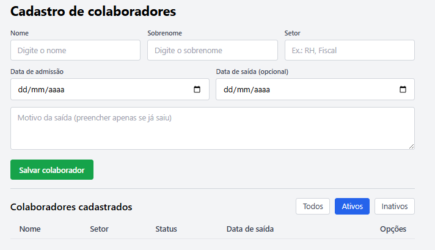
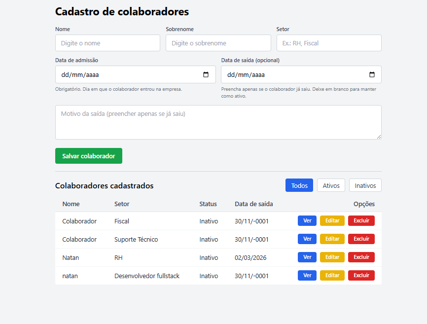
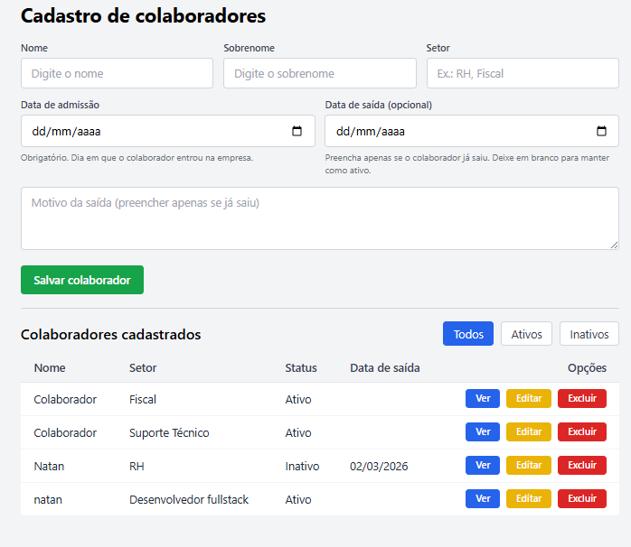

# CRUD em PHP para gestão de colaboradores

Aplicação CRUD em PHP 8 com PDO e Tailwind CSS para gestão de colaboradores de uma empresa, controlando **entrada (admissão)** e **saída (desligamento)**, com filtro por status (ativos/inativos).

## Funcionalidades

- Cadastro de colaboradores com nome, sobrenome, setor e data de admissão.
- Registro de desligamento por meio de data de saída e motivo.
- Listagem de colaboradores com status calculado automaticamente (Ativo/Inativo).
- Filtro rápido por **Todos / Ativos / Inativos**.
- Ações: visualizar, editar e excluir colaborador.

## Modelo de dados principal

Tabela `cadastro` (campos relevantes):

- `id` – chave primária.
- `nome` – nome do colaborador.
- `sobrenome` – sobrenome do colaborador.
- `setor` – setor/departamento.
- `data_admissao` – data de entrada na empresa.
- `data_saida` – data de saída; quando `NULL`, o colaborador é considerado **ativo**.
- `motivo_saida` – motivo do desligamento (opcional).

> Regra de negócio: o status **não** é armazenado em coluna própria; ele é calculado pela aplicação com base em `data_saida` (nulo = Ativo, preenchido = Inativo).

## Fluxos principais

- **Cadastrar colaborador (entrada)** – em `index.php`:
  - Preenche Nome, Sobrenome, Setor e Data de admissão (obrigatória).
  - Campos Data de saída e Motivo da saída podem ficar vazios (colaborador permanece **ativo**).

- **Registrar saída (desligamento)** – em `editar.php`:
  - Para um colaborador ativo, informar Data de saída e Motivo da saída.
  - Ao salvar, a aplicação passa a considerar o colaborador **inativo**.

- **Listar e filtrar** – em `index.php`:
  - Lista todos os colaboradores com Nome, Setor, Status (Ativo/Inativo) e Data de saída.
  - Permite filtrar por **Todos / Ativos / Inativos** via parâmetro `?status=`.

## Screenshots

### Tela principal e listagem

### Filtros e estados diferentes

### Formulário de edição de colaborador

## Tecnologias utilizadas

- PHP 8+ (com PDO para acesso ao MySQL).
- MySQL.
- Tailwind CSS (via CDN) para o layout das telas.
