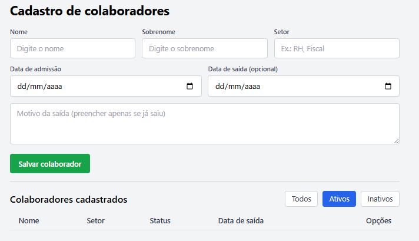
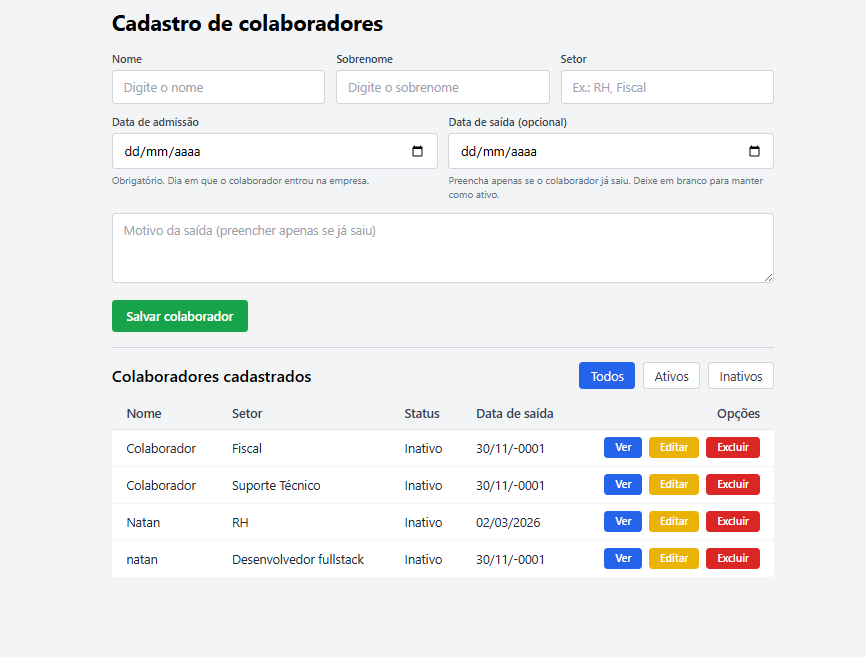
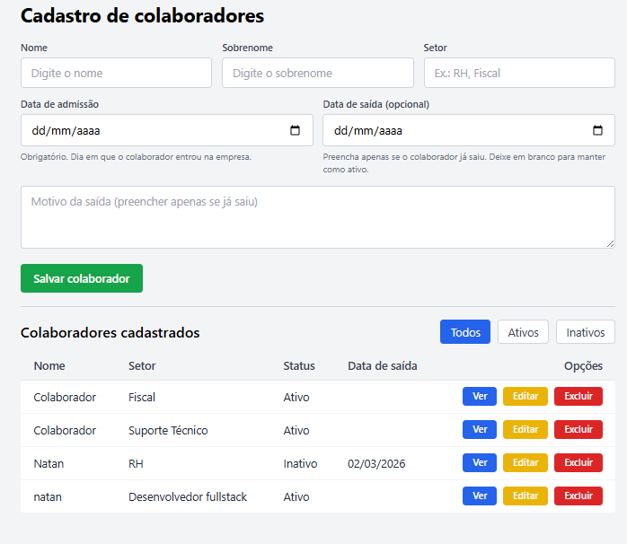

# Sistema de Gestão de Colaboradores (PHP)

## 📖 Sobre o projeto

O **Sistema de Gestão de Colaboradores** é uma aplicação backend desenvolvida em PHP para controlar admissões, desligamentos e informações cadastrais de funcionários.

O projeto demonstra uma modelagem que evita armazenar informações redundantes no banco de dados. Em vez de manter uma coluna de status que dependeria de atualização manual, a aplicação determina se o colaborador está ativo ou inativo a partir do campo `data_saida`. Essa abordagem reduz inconsistências e mantém o estado exibido alinhado aos dados do desligamento.

## Regras de negócio

- Quando `data_saida` é `NULL`, o colaborador é considerado **Ativo**;
- quando `data_saida` possui uma data, o colaborador é considerado **Inativo**;
- o status não é salvo no banco de dados;
- o status é sempre calculado em tempo de execução;
- o registro de desligamento exige uma data de saída;
- o filtro da listagem utiliza a mesma regra de derivação do status.

## Modelo de dados

Os colaboradores são armazenados na tabela `cadastro`, composta pelos seguintes campos:

| Campo | Descrição |
| --- | --- |
| `id` | Chave primária do registro |
| `nome` | Nome do colaborador |
| `sobrenome` | Sobrenome do colaborador |
| `setor` | Setor ou departamento |
| `data_admissao` | Data de entrada na empresa |
| `data_saida` | Data de desligamento; `NULL` indica colaborador ativo |
| `motivo_saida` | Motivo do desligamento, quando informado |

## ✨ Funcionalidades

- Cadastro de colaboradores;
- registro da data de admissão;
- registro de desligamento com data e motivo da saída;
- listagem dos colaboradores;
- cálculo automático do status Ativo ou Inativo;
- filtro por status: Todos, Ativos ou Inativos;
- visualização dos dados cadastrados;
- edição dos colaboradores;
- exclusão de registros.

### Fluxos principais

O cadastro é realizado em `index.php` e exige nome, sobrenome, setor e data de admissão. Como não há data de saída nesse momento, o novo colaborador é apresentado como ativo.

O desligamento é registrado em `editar.php` por meio do preenchimento da data de saída e, opcionalmente, do motivo. Após essa alteração, o status calculado passa a ser inativo.

A listagem fica disponível em `index.php` e apresenta nome, setor, status calculado e data de saída. Os filtros são aplicados pela query string:

```text
?status=todos
?status=ativo
?status=inativo
```

## 🖼️ Screenshots

### Tela principal



### Filtros aplicados



### Edição de colaborador



## 🚀 Tecnologias

- PHP para as regras da aplicação e o processamento no backend;
- MySQL ou banco de dados compatível para persistência;
- HTML para estruturar a interface;
- CSS para apresentação visual.

## ⚙️ Como executar

### Pré-requisitos

- PHP instalado ou um ambiente local como XAMPP, WAMP ou Laragon;
- servidor Apache;
- MySQL ou banco compatível;
- Git.

### Instalação

1. Clone o repositório:

```bash
git clone <URL_DO_REPOSITORIO>
```

2. Mova ou clone a pasta do projeto para o diretório público do ambiente local:

   - XAMPP: `htdocs`;
   - WAMP: `www`;
   - Laragon: `www`.

3. Caso o projeto forneça um arquivo SQL, importe-o pelo gerenciador do banco de dados para criar a tabela `cadastro`.

4. Configure no código a conexão com o banco, informando host, banco de dados, usuário e senha correspondentes ao ambiente local.

5. Inicie os serviços Apache e MySQL pelo painel do XAMPP, WAMP ou Laragon.

6. Acesse o projeto pelo navegador, ajustando o nome da pasta quando necessário:

```text
http://localhost/<PASTA_DO_PROJETO>/
```

## 📂 Estrutura do projeto

O projeto possui dois arquivos PHP principais e um diretório dedicado às imagens da documentação:

```text
.
├── index.php
├── editar.php
└── img/
    ├── cadastro1.PNG
    ├── cadastro2.PNG
    └── cadastro3.PNG
```

- `index.php`: cadastro, listagem e filtro dos colaboradores;
- `editar.php`: edição dos dados e registro de desligamento;
- `img/`: screenshots utilizados no README.

## 🌐 Deploy

O projeto é uma aplicação PHP tradicional e pode ser hospedado em qualquer servidor compatível com PHP e MySQL, ou outro banco suportado pela configuração utilizada.

Para uso local, a aplicação pode ser executada com XAMPP, WAMP ou Laragon. Em uma hospedagem remota, é necessário publicar os arquivos PHP, criar ou importar a estrutura do banco de dados e configurar as credenciais de conexão fornecidas pelo servidor.

## 👤 Autor

**Natan Da Luz**

- LinkedIn: [linkedin.com/in/natandaluz](https://www.linkedin.com/in/natandaluz/)
- Portfólio: [portfolionatan.vercel.app](https://portfolionatan.vercel.app/)
- E-mail: [natandaluz01@gmail.com](mailto:natandaluz01@gmail.com)

## 📄 Licença

Este projeto está sem uma licença definida no momento.
